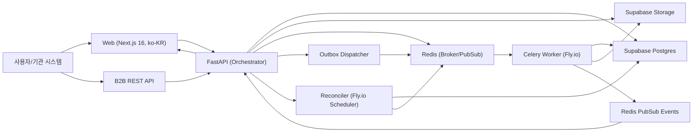

# NeuroHub Technical PRD (Supabase + FastAPI + SQLAlchemy)

## 1. 문서 정보
- 문서명: NeuroHub Technical PRD
- 버전: v1.0
- 작성일: 2026-02-21
- 기준 저장소: `/Users/paksungho/Downloads/neurohub/NeuroHub`
- 기준 코드:
  - Backend: FastAPI + SQLAlchemy + Alembic + Celery
  - Frontend: Next.js 16 (App Router) + TanStack Query + Tailwind v4 (한국어 우선 UI)
- 문서 목적: 즉시 개발 착수가 가능한 상세 기술 명세 제공

## 2. 제품 정의와 목표
NeuroHub는 "단일 분석 알고리즘 서비스"가 아니라 "의료 AI 분석 워크플로우 오케스트레이션 플랫폼"이다.  
핵심은 분석 정확도 자체보다 다음을 시스템적으로 보장하는 것이다.

- 요청(Request) 중심 상태 기반 처리
- 분석 실행의 재현성 (snapshot + run provenance)
- 기관 단위(B2B) 격리와 감사 추적
- 중복 실행/중복 과금 방지
- 운영 자동화(Worker 장애/재시도/정합성 복구)

## 3. 핵심 의사결정

### 3.1 Supabase 사용 범위
- 사용: Auth, Postgres(DB), Storage
- 보조: Realtime는 초기 범위에서 필수 아님 (Redis SSE 유지)

### 3.2 ORM 의사결정
- 서버/워커가 Python 기반이므로 ORM은 `SQLAlchemy` 유지
- 마이그레이션은 `Alembic` 유지
- `Prisma ORM`은 Node/TS 런타임 중심이므로 Python 서비스의 주 ORM으로 채택하지 않음

### 3.3 런타임/배포
- API/Worker/Reconciler는 Fly.io에 분리 배포
- 큐는 Redis
- 장기 저장은 Supabase Storage (S3 호환 정책 포함)

### 3.4 프론트 스택 준수 정책 (APIKEY.rtf 기준)
본 프로젝트는 프론트엔드에 한해 `APIKEY.rtf`의 스택을 최대한 준수한다.

우선 적용 항목:
- Runtime: Bun 1.x
- Framework: Next.js 16 (App Router)
- Language: TypeScript 5.x (strict 모드)
- Styling: Tailwind CSS v4
- UI: shadcn/ui + Radix
- Server State: TanStack Query v5.x (latest stable)
- Validation: Zod 또는 Valibot
- Tooling: Biome (lint/format)
- Font: Noto Sans KR (기본), Geist Mono (코드/숫자 UI)
- Icon: Phosphor Icons
- Emoji Policy: Zero-Emoji
- Frontend Hosting: Vercel

예외/경계:
- Python 오케스트레이션 도메인(`requests/runs/qc/reports/ledger`)의 주 ORM은 SQLAlchemy 유지
- Drizzle ORM은 "프론트/Node 영역"에서만 선택적으로 사용 가능
- 핵심 의료 워크플로우 테이블 쓰기는 FastAPI(SQLAlchemy)만 수행

### 3.5 ADR: Inngest 채택 범위
결론: **Inngest는 현재 코어 오케스트레이터로 채택하지 않는다.**

코어 워크플로우 기준 스택:
- FastAPI + SQLAlchemy + Outbox + Celery/Redis + Reconciler

판단 근거:
- 핵심 실행 경로가 이미 Python 중심 + compute-heavy 구조다.
- Inngest를 코어에 도입하면 오케스트레이션 평면이 이중화되어 운영 복잡도/장애 분석 난이도가 상승한다.
- NeuroHub는 상태 전이, 멱등성, 과금/감사 일관성을 DB 트랜잭션과 강하게 결합해야 하며, Celery+Outbox가 이 요구에 직접 부합한다.
- PHI 민감 시스템 특성상 외부 워크플로우 의존성은 최소화하는 것이 안전하다.

적용 정책:
- Phase 1~2: 코어 업무흐름은 Celery/Outbox만 사용
- Phase 3+: Inngest는 비핵심/비PHI 주변 자동화에 한해 옵션으로 검토
  - 예: 알림 fan-out, 운영 리마인더, 내부 webhook 재시도

## 4. 범위

### 4.1 In Scope
- 기관 멀티테넌시 (institution_id 전면 도입)
- B2C/B2B 공통 요청 워크플로우
- 상태머신 강제
- 업로드 세션/완료 검증
- Run/QC/Report/Review 전체 플로우
- usage ledger (RESERVE/CAPTURE/RELEASE)
- idempotency 엄격 계약
- 한국어 우선 웹 UI/UX

### 4.2 Out of Scope (Phase 1 제외)
- PACS/FHIR 양방향 실연동의 완전 상용화
- 멀티 리전 액티브-액티브
- 완전 자동 BI 레포팅

## 5. 사용자 및 역할

| 역할 | 설명 | 핵심 권한 |
|---|---|---|
| SYSTEM_ADMIN | 전사 시스템 운영자 | 모든 기관/서비스 관리 |
| SERVICE_ADMIN | 서비스 카탈로그 관리자 | 서비스/파이프라인 등록/배포 |
| DEPT_ADMIN | 부서 운영 관리자 | 부서 범위 조회/운영 |
| PHYSICIAN | 임상의 | 요청 생성/조회 |
| TECHNICIAN | 기술 운영자 | 업로드/실행 보조, QC 일부 |
| REVIEWER | 전문가 판독 | QC/전문가 리뷰 |
| AUDITOR | 감사 담당 | 감사/접근 로그 조회 |
| B2B_API_CLIENT | 기관 시스템 계정 | API key로 자동 요청/조회 |

## 6. 제품 원칙
- 상태 우회 금지: 정의된 상태 전이만 허용
- commit 전 enqueue 금지
- append-only ledger
- 멱등성은 "같은 키+같은 payload만 재사용"
- 기관 범위 외 데이터 접근 불가
- 프론트 기본 언어는 한국어 (`ko-KR`)

## 7. 시스템 아키텍처



### 7.1 프로세스 구성 (Main + Sidecar)

각 서비스는 메인 프로세스와 보조(sidecar) 프로세스를 분리해 운영한다.

공통 sidecar:
- `otel-collector`: trace/metric/log 수집 후 중앙 관제 전송
- `log-forwarder`: JSON 구조화 로그 전송 (PHI 마스킹 필수)
- `egress-proxy` (선택): 외부 호출 경로 통제 및 allowlist 강제

서비스별:
- API:
  - main: uvicorn + FastAPI
  - sidecar: otel-collector, log-forwarder
- Worker:
  - main: celery worker
  - sidecar: heartbeat watchdog (worker 프로세스 hang 탐지), otel-collector
- Reconciler:
  - main: scheduler/reconciler
  - sidecar: distributed lock monitor

원칙:
- 메인 프로세스 장애가 sidecar 장애로 전파되지 않도록 분리
- sidecar는 도메인 write를 수행하지 않음
- sidecar 재시작은 무중단 가능해야 함

## 8. 기존 Python 코드와 호환 기준

다음 테이블/모델은 유지하고 확장한다.
- `service_definitions`, `pipeline_definitions`
- `requests`, `cases`, `case_files`, `upload_sessions`
- `runs`, `run_steps`
- `qc_decisions`
- `reports`, `report_reviews`
- `notifications`
- `audit_logs`, `patient_access_logs`

호환 원칙:
- 기존 컬럼명 변경 최소화
- 신규 필드는 additive migration으로 추가
- endpoint path는 가능한 한 유지
- enum 확장은 backwards compatible하게 추가

## 9. 데이터 모델 (Phase 1 목표)

## 9.1 핵심 신규 테이블

### institutions
- `id UUID PK`
- `code VARCHAR(50) UNIQUE NOT NULL`
- `name VARCHAR(200) NOT NULL`
- `status VARCHAR(20) NOT NULL DEFAULT 'ACTIVE'`
- `created_at TIMESTAMPTZ NOT NULL DEFAULT now()`
- `updated_at TIMESTAMPTZ`

### institution_members
- `institution_id UUID FK institutions(id)`
- `user_id UUID FK users(id)`
- `role_scope VARCHAR(50) NULL`
- `created_at TIMESTAMPTZ NOT NULL DEFAULT now()`
- PK: `(institution_id, user_id)`

### institution_api_keys
- `id UUID PK`
- `institution_id UUID FK institutions(id) NOT NULL`
- `name VARCHAR(100) NOT NULL`
- `key_prefix VARCHAR(20) NOT NULL`
- `key_hash VARCHAR(255) NOT NULL`
- `status VARCHAR(20) NOT NULL DEFAULT 'ACTIVE'`
- `last_used_at TIMESTAMPTZ`
- `expires_at TIMESTAMPTZ`
- `created_at TIMESTAMPTZ NOT NULL DEFAULT now()`
- `created_by UUID FK users(id)`
- index: `(institution_id, status)`, `(key_prefix)`

### idempotency_keys
- `id UUID PK`
- `scope VARCHAR(30) NOT NULL` (`B2B_REQUEST`, `UI_REQUEST`, ...)
- `idempotency_key VARCHAR(120) NOT NULL`
- `request_hash CHAR(64) NOT NULL`
- `response_status INT`
- `response_body JSONB`
- `resource_type VARCHAR(50)`
- `resource_id UUID`
- `expires_at TIMESTAMPTZ NOT NULL`
- `created_at TIMESTAMPTZ NOT NULL DEFAULT now()`
- unique: `(scope, idempotency_key)`

### usage_ledger
- `id UUID PK`
- `institution_id UUID FK institutions(id) NOT NULL`
- `request_id UUID FK requests(id)`
- `run_id UUID FK runs(id)`
- `service_id UUID FK service_definitions(id) NOT NULL`
- `service_version VARCHAR(30) NOT NULL`
- `charge_type VARCHAR(20) NOT NULL` (`RESERVE`, `CAPTURE`, `RELEASE`)
- `units NUMERIC(18,6) NOT NULL`
- `unit_price NUMERIC(18,6) NOT NULL`
- `amount NUMERIC(18,6) NOT NULL`
- `currency CHAR(3) NOT NULL DEFAULT 'USD'`
- `idempotency_token VARCHAR(100)`
- `metadata JSONB`
- `created_at TIMESTAMPTZ NOT NULL DEFAULT now()`
- unique: `(run_id, charge_type)` (run_id null 허용 정책 별도 정의)
- index: `(institution_id, created_at desc)`, `(request_id)`

### outbox_events
- `id UUID PK`
- `event_type VARCHAR(50) NOT NULL`
- `aggregate_type VARCHAR(50) NOT NULL`
- `aggregate_id UUID NOT NULL`
- `payload JSONB NOT NULL`
- `status VARCHAR(20) NOT NULL DEFAULT 'PENDING'`
- `retry_count INT NOT NULL DEFAULT 0`
- `available_at TIMESTAMPTZ NOT NULL DEFAULT now()`
- `created_at TIMESTAMPTZ NOT NULL DEFAULT now()`
- `processed_at TIMESTAMPTZ`
- index: `(status, available_at)`

## 9.2 기존 테이블 확장

아래 컬럼을 add:
- `users`: `supabase_user_id UUID UNIQUE NULL`
- `service_definitions`: `institution_id UUID NULL` (공용 서비스는 NULL 허용)
- `requests`: `institution_id UUID NOT NULL`, `current_run_id UUID NULL`, `cancel_reason TEXT NULL`
- `cases`: `institution_id UUID NOT NULL`
- `case_files`: `institution_id UUID NOT NULL`
- `runs`: `institution_id UUID NOT NULL`, `cost_amount NUMERIC(18,6) NULL`
- `reports`: `institution_id UUID NOT NULL`
- `qc_decisions`: `institution_id UUID NOT NULL`
- `audit_logs`: `institution_id UUID NULL` (시스템 이벤트는 NULL)
- `patient_access_logs`: `institution_id UUID NOT NULL`
- `notifications`: `institution_id UUID NOT NULL`

## 9.3 상태 enum 표준화

### RequestStatus
- `CREATED`
- `RECEIVING`
- `STAGING`
- `READY_TO_COMPUTE`
- `COMPUTING`
- `QC`
- `REPORTING`
- `EXPERT_REVIEW` (optional)
- `FINAL`
- `FAILED`
- `CANCELLED` (신규)

### RunStatus
- 내부 DB 표준: `PENDING`, `RUNNING`, `SUCCEEDED`, `FAILED`
- 하위호환:
  - 기존 `QUEUED` -> `PENDING`
  - 기존 `COMPLETED` -> `SUCCEEDED`
- API 응답은 transition 기간 동안 alias 제공 가능

## 9.4 인덱스 및 제약
- `requests(institution_id, status, created_at desc)`
- `requests(requested_by, created_at desc)`
- `cases(request_id, patient_ref)`
- `runs(request_id, status, created_at desc)`
- `run_steps(run_id, step_index)` unique
- `reports(request_id)` unique
- `idempotency_keys(scope, idempotency_key)` unique
- `usage_ledger(run_id, charge_type)` unique
- `outbox_events(status, available_at, created_at)` composite index

### 9.4.1 동시성 제어 규칙
- Request 제출/확정/QC/리뷰는 `SELECT ... FOR UPDATE` 사용
- 동일 request에 대한 중복 submit 방지용 optimistic lock version 필드 권장 (`lock_version INT`)
- outbox 소비는 `FOR UPDATE SKIP LOCKED` 사용
- 재시도 안전성 확보를 위해 모든 command handler는 멱등해야 함

## 9.5 SQLAlchemy 모델 호환 매트릭스

| 도메인 | 현행 모델 파일 | 유지 컬럼 | 신규/변경 컬럼 | 마이그레이션 방식 |
|---|---|---|---|---|
| User | `apps/api/app/models/user.py` | `id`, `username`, `department`, `is_active` | `supabase_user_id` | nullable add -> backfill -> unique |
| Service | `apps/api/app/models/service.py` | `name`, `display_name`, `version`, `status` | `institution_id` | nullable add (global 서비스 허용) |
| Request | `apps/api/app/models/request.py` | `service_id`, `pipeline_id`, `status`, `priority`, `idempotency_key` | `institution_id`, `current_run_id`, `cancel_reason` | add + index + FK |
| Case | `apps/api/app/models/request.py` | `request_id`, `patient_ref`, `status` | `institution_id` | add + index |
| CaseFile | `apps/api/app/models/request.py` | `case_id`, `slot_name`, `storage_path`, `upload_status` | `institution_id` | add + index |
| Run | `apps/api/app/models/run.py` | `request_id`, `case_id`, `status`, `job_spec`, `result_manifest` | `institution_id`, `cost_amount`, 상태 enum 표준화 | enum migration + alias |
| RunStep | `apps/api/app/models/run.py` | `run_id`, `step_index`, `status` | 변경 없음 | unique(run_id, step_index) 점검 |
| QC | `apps/api/app/models/qc_decision.py` | `request_id`, `decision`, `qc_score` | `institution_id` | add + index |
| Report | `apps/api/app/models/report.py` | `request_id`, `status`, `content`, `pdf_storage_path` | `institution_id` | add + index |
| Notification | `apps/api/app/models/notification.py` | `user_id`, `event_type`, `title`, `is_read` | `institution_id` | add + index |
| Audit | `apps/api/app/models/audit.py` | `action`, `entity_type`, `entity_id`, `before_state`, `after_state` | `institution_id` | nullable add |

추가 신규 모델 파일:
- `apps/api/app/models/institution.py` (`institutions`, `institution_members`, `institution_api_keys`)
- `apps/api/app/models/idempotency.py` (`idempotency_keys`)
- `apps/api/app/models/billing.py` (`usage_ledger`)
- `apps/api/app/models/outbox.py` (`outbox_events`)

## 9.6 Alembic 구현 가이드 (요약)

1. `institution_id`를 먼저 nullable로 추가한다.
2. 기본 기관(`DEFAULT_INSTITUTION`)을 생성한다.
3. 기존 데이터 전체를 기본 기관으로 backfill한다.
4. NOT NULL 제약을 단계적으로 적용한다.
5. 인덱스/unique를 마지막 단계에서 추가한다.

권장 migration 순서:
- `rev_01_add_institutions`
- `rev_02_add_institution_id_columns`
- `rev_03_backfill_default_institution`
- `rev_04_add_idempotency_usage_outbox`
- `rev_05_enum_normalization_run_status`

주의:
- 대용량 테이블 인덱스는 `CONCURRENTLY` 전략 고려
- enum rename 대신 새 enum + data migration + old drop 접근 권장

## 9.7 데이터 보존/삭제 정책
- 기본 원칙:
  - 의료 데이터는 기관 계약/법규에 따라 보존 기간을 분리
  - 삭제는 hard delete가 아닌 soft delete + 보관 정책 우선
- 권장 보존 기간(초안):
  - audit_logs: 5년
  - patient_access_logs: 5년
  - reports(pdf/json): 3년 (기관 정책에 따라 연장)
  - raw uploads: 90일 (재현성 정책이 있으면 연장)
- 삭제 처리:
  - `deleted_at`, `deleted_by`, `delete_reason` 추적 필드 사용 권장
  - 삭제 작업은 비동기 배치 + 감사로그 강제
- Legal Hold:
  - 분쟁/감사 대상 request는 삭제 제외 플래그(`legal_hold=true`) 적용

## 10. 상태머신 정의

## 10.1 Request 전이
- `CREATED -> RECEIVING`
- `RECEIVING -> STAGING`
- `STAGING -> READY_TO_COMPUTE`
- `READY_TO_COMPUTE -> COMPUTING`
- `COMPUTING -> QC`
- `QC -> REPORTING`
- `REPORTING -> FINAL`
- `QC -> EXPERT_REVIEW -> FINAL` (옵션 경로)
- `ANY NON-TERMINAL -> FAILED`
- `{CREATED, RECEIVING, STAGING, READY_TO_COMPUTE} -> CANCELLED`

금지:
- terminal(`FINAL`,`FAILED`,`CANCELLED`)에서 비단말 전이
- 단계 건너뛰기

## 10.2 Run 전이
- `PENDING -> RUNNING -> SUCCEEDED | FAILED`
- `FAILED run` 재사용 금지 (재실행은 신규 run 생성)

## 11. API 계약

## 11.1 기존 API 유지
- `/api/v1/requests`
- `/api/v1/requests/{id}/transition`
- `/api/v1/requests/{id}/submit`
- `/api/v1/requests/{id}/qc-decision`
- `/api/v1/requests/{id}/generate-report`
- `/api/v1/requests/{id}/review`
- `/api/v1/runs`, `/api/v1/runs/{id}`

## 11.2 신규/보강 API

### 워크플로우 보강
- `POST /api/v1/requests/{id}/confirm` (STAGING -> READY_TO_COMPUTE)
- `POST /api/v1/requests/{id}/cancel`

### B2B
- `POST /api/v1/b2b/requests`
- `POST /api/v1/b2b/requests/{id}/files/presign`
- `POST /api/v1/b2b/requests/{id}/files/complete`
- `GET /api/v1/b2b/requests/{id}`

### 기관/키 관리
- `GET /api/v1/admin/institutions`
- `POST /api/v1/admin/institutions`
- `POST /api/v1/admin/institutions/{id}/api-keys`
- `POST /api/v1/admin/institutions/{id}/api-keys/{key_id}/revoke`

## 11.3 Idempotency 계약 (강제)
- 대상: 생성형 API (`/requests`, `/b2b/requests`, 파일 complete, submit 등)
- 규칙:
  - 동일 key + 동일 payload hash => 기존 응답 재사용
  - 동일 key + 다른 payload hash => `409 Conflict`
- key 저장 위치: `idempotency_keys` 테이블
- TTL 기본: 24h (정책으로 조정)

구현 규칙(필수):
- payload hash는 canonical JSON(정렬된 key, 공백 제거)로 계산
- hash 알고리즘: SHA-256
- 비교 단위: `(scope, idempotency_key, request_hash)`
- race condition 방지: unique 제약 + insert-on-conflict 전략

## 11.4 오류 코드 표준
- `400` validation
- `401` unauthenticated
- `403` unauthorized
- `404` not found
- `409` conflict (state/idempotency)
- `422` semantic invalid transition
- `500` internal

## 11.5 핵심 API 스키마 예시

### POST `/api/v1/requests`
요청:
```json
{
  "service_id": "9d8b1f1e-5d44-4e5f-8a8e-e03cb2f8a100",
  "pipeline_id": "3f17e8f9-8a95-4385-96ec-8ff3f8ffaf11",
  "priority": 5,
  "cases": [
    {
      "patient_ref": "PT-2026-0001",
      "demographics": {
        "age": 67,
        "sex": "F"
      }
    }
  ],
  "idempotency_key": "req_20260221_0001"
}
```

응답:
```json
{
  "id": "f2d65b62-7a55-4f0c-a90e-19f8fca2a210",
  "status": "CREATED",
  "priority": 5,
  "case_count": 1,
  "institution_id": "0d12d4df-6b2a-471e-a2a1-f63a7fd17771",
  "created_at": "2026-02-21T10:00:00Z"
}
```

### POST `/api/v1/requests/{id}/confirm`
요청:
```json
{
  "confirm_note": "입력 및 업로드 자료 확인 완료"
}
```

응답:
```json
{
  "id": "f2d65b62-7a55-4f0c-a90e-19f8fca2a210",
  "status": "READY_TO_COMPUTE",
  "updated_at": "2026-02-21T10:20:00Z"
}
```

### POST `/api/v1/requests/{id}/submit`
응답:
```json
[
  {
    "id": "d3575255-d113-4a72-a40f-f0b4e36f4fa3",
    "request_id": "f2d65b62-7a55-4f0c-a90e-19f8fca2a210",
    "case_id": "aa8d5ea9-1c8d-458e-9ca4-dd3f42551d56",
    "status": "PENDING",
    "created_at": "2026-02-21T10:21:00Z"
  }
]
```

### Idempotency 충돌 예시 (`409`)
```json
{
  "error": "IDEMPOTENCY_CONFLICT",
  "message": "Same idempotency key was used with different payload.",
  "idempotency_key": "req_20260221_0001"
}
```

### B2B API key 인증 실패 (`401`)
```json
{
  "error": "INVALID_API_KEY",
  "message": "API key is invalid or expired."
}
```

## 12. 인증/인가

## 12.1 Supabase Auth
- 클라이언트: Supabase session(JWT) 획득
- API: Bearer JWT 검증 (JWKS)
- `users.supabase_user_id`와 매핑

## 12.2 B2B API Key
- `X-API-Key` 헤더
- 평문키는 저장 금지, hash만 저장
- prefix 조회 후 constant-time hash 검증

## 12.3 기관 범위 강제
- 모든 리소스 조회/수정 시 `institution_id` 필터 강제
- 앱 레벨 필터 + DB 정책 병행

## 12.4 Supabase RLS 적용 원칙
- 원칙:
  - 사용자 직접 접근 테이블에는 RLS 기본 활성화
  - 정책은 `institution_id`와 사용자 역할 claim을 동시 검증
- 예시 정책(개념):
  - SELECT `requests`: `institution_id = auth.jwt()->>'institution_id'`
  - UPDATE `requests`: 역할이 `SYSTEM_ADMIN` 또는 리소스 owner 조건 충족
- 주의:
  - 서버의 `service role key`는 RLS 우회 권한을 가질 수 있으므로 API 서버 내부에서만 사용
  - 클라이언트에는 절대 노출 금지
- 검증:
  - 정책 테스트를 CI에서 실행 (기관 A 계정으로 기관 B 데이터 조회 차단 확인)

## 13. 스토리지 설계 (Supabase Storage)

버킷:
- `neurohub-inputs` (원본 업로드)
- `neurohub-outputs` (분석 결과)
- `neurohub-reports` (PDF/JSON)

키 경로 규칙:
- `institutions/{institution_id}/requests/{request_id}/cases/{case_id}/{slot_name}/{filename}`
- `institutions/{institution_id}/runs/{run_id}/steps/{step_index}/{artifact}`
- `institutions/{institution_id}/reports/{request_id}/report.pdf`

업로드 정책:
- presigned URL 발급
- complete 호출 시 존재 검증 + checksum 저장

### 13.1 스토리지 강건성 요구
- 체크섬:
  - 업로드 완료 시 `sha256` 검증 필수
  - checksum mismatch 시 즉시 `FAILED` 전이 + 재업로드 요청
- 무결성:
  - 결과물(`outputs/reports`)은 immutable 경로 정책 적용 (overwrite 금지)
  - artifact manifest에 파일 크기/해시/생성시각 기록
- 보안:
  - private bucket 기본
  - presigned URL 만료 15분(대용량 업로드는 multipart + renew)
  - 악성 파일 스캔 파이프라인(비동기) 도입 권장
- 수명주기:
  - 원본 업로드 보관 기간(예: 90일) 정책화
  - 보고서 PDF 장기보관 정책 분리

### 13.2 대용량 업로드 처리
- multipart/chunk 업로드 지원
- 클라이언트 재시도 시 part 단위 resume
- 최종 complete 호출 전 part 집계 검증
- 네트워크 불안정 환경에서 업로드 재개 UX 제공

## 14. 트랜잭션 및 메시징

## 14.1 원칙
- DB commit 이전 queue enqueue 절대 금지

## 14.2 Outbox 패턴
쓰기 트랜잭션에서:
- 도메인 변경 (`requests`,`runs`,...)
- `outbox_events` insert
- commit

별도 dispatcher:
- `PENDING` 이벤트 poll
- 큐 publish
- 성공 시 `PROCESSED`
- 실패 시 retry/backoff

### 14.4 큐 토폴로지 및 DLQ
- 큐 분리:
  - `queue.compute.high`
  - `queue.compute.normal`
  - `queue.reporting`
  - `queue.reconcile`
- 실패 처리:
  - 최대 재시도 초과 시 DLQ로 이동
  - DLQ 소비는 운영자 승인 기반 재처리
- 중복 소비 방지:
  - worker ack-late + task idempotency key 조합
- starvation 방지:
  - priority queue와 별도 worker pool 분리 운영

### 14.5 전달 보장(Delivery Guarantee)
- 목표:
  - at-least-once delivery + idempotent consumer로 실질적 exactly-once 효과 달성
- 원칙:
  - task handler는 재실행되어도 결과가 동일해야 함
  - 외부 부작용(write/billing/notification)은 idempotency token으로 보호
- 금지:
  - "단 한 번만 실행된다"는 가정으로 로직 구현 금지

## 14.3 트랜잭션 시퀀스 (핵심 3개)

### A. submit 시퀀스
1. 요청 상태 검증 (`READY_TO_COMPUTE`)
2. run + run_steps insert
3. request 상태 `COMPUTING` update
4. outbox(`RUN_SUBMITTED`) insert
5. commit
6. dispatcher가 큐 publish

### B. QC PASS 시퀀스
1. request row lock
2. qc_decision insert
3. request 상태 `REPORTING` update
4. outbox(`GENERATE_REPORT`) insert
5. commit

### C. REVIEW REVISE 시퀀스
1. report_review insert
2. request 상태 `COMPUTING` update
3. outbox(`RECOMPUTE_REQUEST`) insert
4. commit

## 15. 워커/리컨실러

## 15.1 Worker
- Celery task가 run 실행
- heartbeat 주기 갱신
- run step 단위 로그/artifact 기록
- 완료 callback 또는 DB 업데이트 정책은 Orchestrator 단일화 우선

## 15.2 Reconciler
- stale run 탐지 (`heartbeat_at` 기반)
- timeout/재시도/실패 전환
- orphan outbox 재처리
- ledger 정합성 검사

### 15.3 Reconciler 상세 정책
- stale 기준:
  - `heartbeat_at`이 `compute_stale_threshold` 초과 + `RUNNING` 상태
- 조치:
  - 1차: soft retry enqueue
  - 2차: `FAILED` 전이 + `RELEASE` ledger 기록
- 정합성 점검:
  - `runs.status=SUCCEEDED`인데 CAPTURE 누락 시 보정 job 생성
  - `runs.status=FAILED`인데 RELEASE 누락 시 보정 job 생성
- 리더 선출:
  - Redis 분산락으로 단일 reconciler만 활성

## 16. 프론트엔드 PRD (한국어 우선)

## 16.0 프론트 기술 스택 (필수)

`APIKEY.rtf` 기준으로 아래 스택을 기본값으로 고정한다.

| 레이어 | 채택 스택 | 비고 |
|---|---|---|
| Runtime | Bun 1.x | `bun --bun run dev` 기준 |
| Package Manager | bun | lockfile은 `bun.lockb` |
| Framework | Next.js 16 App Router | RSC/Route Handler 기준 |
| Language | TypeScript 5.x | `strict: true`, `noUncheckedIndexedAccess: true` 권장 |
| Styling | Tailwind CSS v4 | CSS-first + container query 활용 |
| UI Component | shadcn/ui + Radix | 접근성/헤드리스 컴포넌트 |
| Data Fetch | TanStack Query v5.x (latest stable) | 서버 상태 캐시/재시도 |
| Validation | Zod/Valibot | 폼/응답 스키마 공통 |
| Lint/Format | Biome | ESLint+Prettier 대체 |
| Typography | Noto Sans KR, Geist Mono | 한국어 가독성 우선 |
| Icons | Phosphor Icons | semantic color 규칙 |
| Frontend Deploy | Vercel | 웹 계층 전용 |

기술 경계(중요):
- Next.js/Drizzle는 "웹 레이어 최적화" 용도
- 의료 워크플로우 트랜잭션은 FastAPI(SQLAlchemy)에서 관리
- 즉, 프론트는 기본적으로 FastAPI BFF/API를 호출하고, DB 직접 write를 하지 않는다

## 16.1 언어 정책
- 기본 locale: `ko-KR`
- 모든 주요 레이블/오류/도움말 한국어
- 날짜/숫자 포맷 한국어 기준

## 16.2 정보구조(IA)
- 대시보드
- 서비스 카탈로그
- 신규 요청 Wizard
- 요청 상세 (케이스/파일/실행/QC/보고서/검토)
- QC 대기열
- 전문가 검토 대기열
- 감사 로그
- 기관/API key 관리(관리자)

## 16.3 신규 요청 Wizard 단계
1. 서비스/파이프라인 선택
2. 케이스 등록
3. 파일 업로드 (필수 slot 충족 확인)
4. 검증/확인 (`RECEIVING -> STAGING`)
5. 실행 준비 확인 (`STAGING -> READY_TO_COMPUTE`)
6. 제출 (`READY_TO_COMPUTE -> COMPUTING`)

## 16.4 UX 규칙
- 401: 로그인 화면 이동
- 403: 접근 불가 페이지
- 409: 충돌 안내 + 현재 상태 표시
- FINAL 도달 시 polling 중지
- 상태 배지는 표준 enum과 1:1 맵핑

### 16.5 UI/UX 강건성 요구
- 접근성:
  - WCAG 2.2 AA 준수
  - 키보드 전용 조작 가능, focus visible 필수
- 성능:
  - request list 10k 행에서 가상 스크롤 지원
  - 초기 화면 LCP 목표 < 2.5s (병원망 기준)
- 복원력:
  - 업로드 중 브라우저 종료 후 재진입 시 resume 안내
  - 장시간 폼 입력은 draft auto-save
- 가시성:
  - 상태 전이 타임라인 UI 제공 (누가/언제/왜)
  - 오류 메시지는 기술코드 + 사용자 설명 동시 제공
- 국제화:
  - 한국어 기본, 영어 fallback
  - 숫자/시간대 표준은 `ko-KR` + 병원 로컬 타임존

## 17. Fly.io 배포 설계

앱 분리:
- `neurohub-api`
- `neurohub-worker`
- `neurohub-reconciler`
- `neurohub-web`

배포 원칙:
- Frontend(`neurohub-web`)는 Vercel 우선 배포
- Python 서비스(`api/worker/reconciler`)는 Fly.io 배포
- 필요 시 `neurohub-web`의 Fly.io 미러 환경을 둘 수 있으나 canonical은 Vercel

환경변수(예시):
- `APP_ENV`
- `DATABASE_URL` (Supabase Postgres)
- `REDIS_URL`
- `SUPABASE_URL`
- `SUPABASE_JWKS_URL`
- `SUPABASE_SERVICE_ROLE_KEY` (서버 전용)
- `SUPABASE_STORAGE_BUCKET_*`
- `IDEMPOTENCY_TTL_SECONDS`

비밀관리:
- Fly secrets 사용
- 저장소에 비밀값 커밋 금지

### 17.1 배포 안정성
- 배포 전략:
  - blue/green 또는 canary (10% -> 50% -> 100%)
- 헬스체크:
  - `/api/v1/health` readyness/liveness 분리
- 롤백:
  - 배포 실패 시 자동 이전 이미지 복귀
- 스키마 배포 순서:
  - migrate -> app deploy -> worker deploy (역순 금지)
- 커넥션 관리:
  - DB pool 상한과 Fly instance 수를 곱해 DB max_connections 초과 금지

### 17.2 DR(재해복구) 목표
- RPO: 15분 이내
- RTO: 60분 이내
- 월 1회 복구 리허설 필수
- 복구 체크리스트:
  - DB restore
  - storage 접근 검증
- outbox 재처리
- 핵심 API synthetic test

### 17.3 Redis/Queue 내구성
- Redis는 단일 인스턴스 운영 금지
- 운영 권장:
  - managed Redis(HA) 또는 sentinel 구성
  - AOF 지속성 + 주기적 snapshot
- 장애 시나리오:
  - broker failover 중 중복 소비 발생 가능 -> consumer idempotency로 방어
- 관제 지표:
  - queue depth, retry rate, DLQ count, consumer lag

## 18. 개발 단계별 실행 계획

## Phase 0: 보안/기반 정리
- 평문 키/토큰 전면 회전
- `.env.example` 표준화
- CI에 secret scan 도입

## Phase 1: 데이터모델 확장
- Alembic migration:
  - institutions 계열
  - idempotency_keys
  - usage_ledger
  - outbox_events
  - institution_id 컬럼 추가/백필

## Phase 2: 백엔드 리팩터링
- 상태머신에 `CANCELLED` 반영
- `confirm/cancel` endpoint 추가
- idempotency strict check 구현
- outbox dispatcher 구현
- queue 디스패치 경계 수정 (commit 후 publish)

## Phase 3: 인증 전환
- Supabase JWT 검증 dependency 추가
- 기존 Keycloak dependency는 feature flag로 병행 지원 후 제거
- B2B API key auth middleware 추가

## Phase 4: 프론트 리뉴얼
- Next.js 16 + Bun + Tailwind v4
- 한국어 우선 i18n 체계
- Wizard 업로드/확인/제출 완성

## Phase 5: 운영 안정화
- Reconciler 주기 작업
- SLO/알람/대시보드
- 장애 복구 리허설

## 19. Python 코드 리팩터링 상세 제안

다음 파일군에 우선 적용:
- `apps/api/app/services/run_executor.py`
  - 트랜잭션 내부 직접 enqueue 제거
  - outbox event 생성으로 변경
- `apps/api/app/services/qc_service.py`
  - report 생성 트리거를 outbox 기반으로 변경
- `apps/api/app/services/review_service.py`
  - recompute 트리거를 outbox 기반으로 변경
- `apps/api/app/api/v1/reports.py`
  - generate-report trigger의 중복 생성/충돌 처리 정교화
- `apps/api/app/middleware/idempotency.py`
  - request body hash 기반 strict conflict 처리
  - 단순 Redis response cache 방식 축소
- `apps/api/app/services/state_machine.py`
  - `CANCELLED` 및 권한정책 반영
- `apps/api/app/schemas/run.py`
  - run 상태명 표준화(alias 전략 포함)

## 20. 품질 및 테스트 전략

테스트 계층:
- unit: 상태머신, validator, idempotency hash 비교
- integration: request->upload->confirm->submit->run->qc->report->review
- contract: OpenAPI snapshot + B2B payload schema
- e2e: 주요 사용자 시나리오(한국어 UI)

필수 테스트:
- 동일 Idempotency-Key 3회 호출 시 entity 1개
- 동일 키 다른 payload 시 409
- commit 전 enqueue 없음 검증
- run 성공 CAPTURE 1회만 기록
- run 실패 RELEASE 1회만 기록
- 기관 간 데이터 격리

### 20.1 비기능 요구사항 (SLO)
- API 가용성: 월 99.9% 이상
- p95 응답시간:
  - 읽기 API < 300ms
  - 쓰기 API < 800ms
- 업로드 성공률: 99.5% 이상
- run 완료 이벤트 유실률: 0%
- 감사로그 기록 누락률: 0%

### 20.2 내구성/장애 테스트
- chaos test:
  - Redis 일시 단절
  - Worker 강제 종료
  - DB failover 상황
- 부하 테스트:
  - 동시 요청 500, 동시 업로드 200, 동시 run 100
- soak test:
  - 24시간 연속 run 처리
- 데이터 정합성 테스트:
  - ledger/audit/outbox 상호 참조 무결성 검증

### 20.3 보안 테스트
- 정적 분석(SAST), 의존성 취약점 스캔(SCA), secret scan
- 인증/인가 침투 테스트:
  - 기관 간 수평 권한 상승 차단 검증
- 감사 로그 위변조 방지 검증

## 21. 수용 기준 (Acceptance Criteria)
- 기관 단위 격리 100% 강제
- 요청 상태 우회 0건
- 중복 과금 0건 (`usage_ledger` unique 보장)
- 동일 key 다른 payload 409 준수율 100%
- 한국어 우선 UI 전 화면 적용
- 장애 시 stale run 자동 정리
- API 가용성 99.9% 달성
- DR 리허설 성공률 100%
- DLQ 적체 0건(운영 SLA 내 처리)

## 22. 리스크 및 대응
- 리스크: 기존 데이터에 institution_id 부재
  - 대응: migration 백필 + NULL 차단 단계적 전환
- 리스크: 인증 전환 중 사용자 혼선
  - 대응: Keycloak/Supabase dual mode 단기 운영
- 리스크: queue 전환 중 누락
  - 대응: outbox replay 도구 제공
- 리스크: 레거시 API 의존
  - 대응: adapter endpoint 유지 후 점진 폐기

## 23. 오픈 이슈
- HIPAA/BAA 계약 범위 최종 확정
- 통화 정책(USD/KRW) 확정
- PACS/FHIR 연동 Phase 기준 확정
- Next.js 전환 시 디자인 시스템 범위 확정

## 24. 즉시 착수 백로그 (개발 티켓 단위)
- T1: Alembic migration v3 (institution + ledger + outbox + idempotency)
- T2: Supabase JWT 검증 dependency 구현
- T3: API key auth + 기관 스코프 middleware
- T4: Request confirm/cancel endpoint
- T5: outbox dispatcher worker
- T6: strict idempotency service
- T7: usage ledger write policy (run success/fail)
- T8: frontend wizard 업로드 단계 구현
- T9: 오류 UX 표준(401/403/409)
- T10: observability 대시보드/알람

---
이 문서는 현행 Python 코드 구조와의 호환성을 유지하면서, Supabase 중심 운영 모델로 확장하기 위한 기준 명세서다.  
실제 구현은 "additive migration + 점진 전환 + 계약 테스트" 원칙으로 진행한다.
